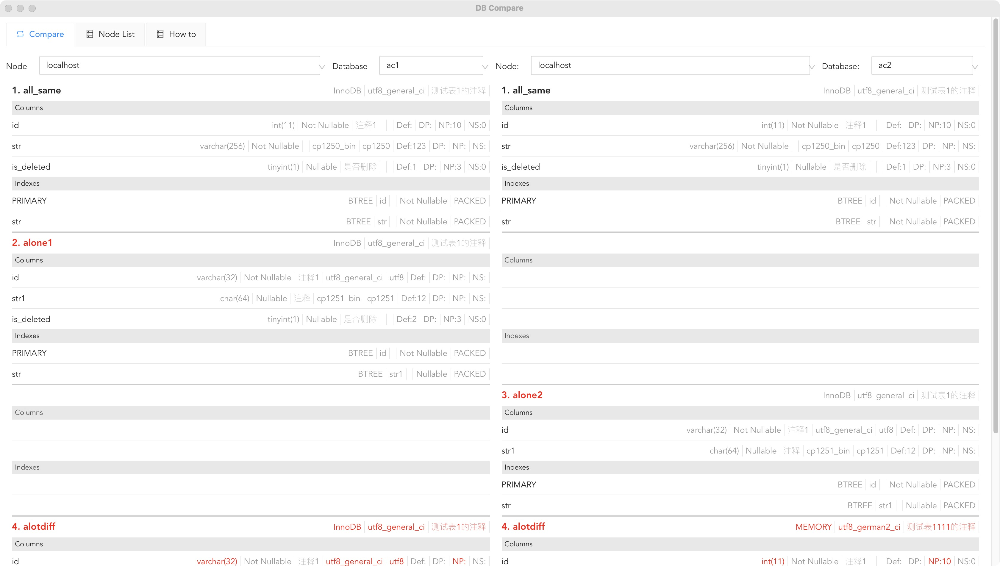

# Info
1. This project is based on https://github.com/ci010/electron-vue-next, doc: https://ci010.github.io/electron-vue-next/zh/
2. UI is based on ant : https://2x.antdv.com/
3. Agent written in go, and source is here:  
# run
1. 安装依赖
````npm install````
2. 创建 dev 服务器，将启动 electron 和 vite 的热重载服务器
````npm run dev````
3. 可选. 将 main 和 renderer 进程编译成 JavaScript，并显示输出大小
````npm run build````
4. 可选. 将所有编译输出打包到一个 electron 应用程序中，以文件夹形式存在
````npm run build:dir````
5. 将所有输出打包到实际的 electron 安装包中
````npm run build:production````
# screenshot


# 关于日志
1. 主线程日志，在控制台看不到。需要使用这个包打印：
https://www.npmjs.com/package/electron-log
日志文件位置：
````
on Linux: ~/.config/{app name}/logs/{process type}.log
on macOS: ~/Library/Logs/{app name}/{process type}.log
on Windows: %USERPROFILE%\AppData\Roaming\{app name}\logs\{process type}.log
````
